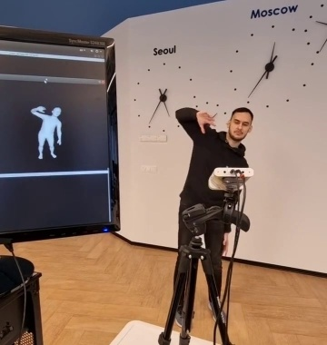

# Abstract

We present a system for real-time RGBD-based estimation of 3D human pose. We use parametric 3D deformable human mesh model (SMPL-X) as a representation and focus on the real-time estimation of parameters for the body pose, hands pose and facial expression from Kinect Azure RGB-D camera. We train estimators of body pose and facial expression parameters. Both estimators use previously published landmark extractors as input and custom annotated datasets for supervision, while hand pose is estimated directly by a previously published method. We combine the predictions of those estimators into a temporally-smooth human pose. We train the facial expression extractor on a large talking face dataset, which we annotate with facial expression parameters. For the body pose we collect and annotate a dataset of 56 people captured from a rig of 5 Kinect Azure RGB-D cameras and use it together with a large motion capture AMASS dataset. Our RGB-D body pose model outperforms the state-of-the-art RGB-only methods and works on the same level of accuracy compared to a slower RGB-D optimization-based solution. The combined system runs at 30 FPS on a server with a single GPU.

# Demo

Follow the code button if you want to try our demo.

<div style="align: left; text-align:center;">

</div> 

# BibTeX

```
@inproceedings{bashirov2021real,
  title={Real-Time RGBD-Based Extended Body Pose Estimation},
  author={Bashirov, Renat and Ianina, Anastasia and Iskakov, Karim and Kononenko, Yevgeniy and Strizhkova, Valeriya and Lempitsky, Victor and Vakhitov, Alexander},
  booktitle={Proceedings of the IEEE/CVF Winter Conference on Applications of Computer Vision},
  pages={2807--2816},
  year={2021}
}
```
